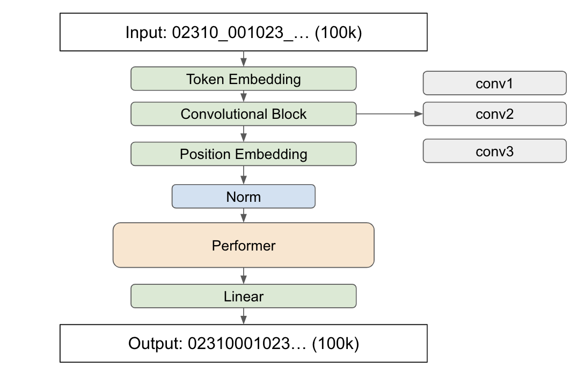
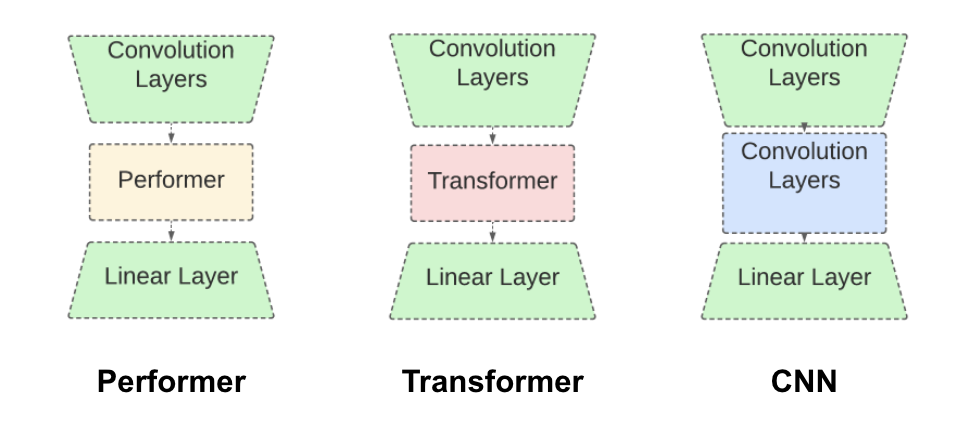

</img>

## DNA_Performer

Our DNA performer project aim to build a time efficient transformer model for DNA seqeunces. We uses Performer architecture which reduces training time from quadratic time to linear time.

### Code

- .model: DNA_Performer, DNA_Transformer, DNA_CNN models we implemented
- .autoencoder: Autoencoder
- .performer_pytorch: Performer embedding layers developed by Lucidrains and his colleague
- Training and Testing for MLM and Downstream are in home directory

### Task

We are focusing on using state-of-the-art time efficient transformer models to do the long-sequence DNA masked language modeling task - training a model to predict a random sample of input tokens that have been replaced by a masked placeholder in a DNA sequence.

The downstream task we plan on is the identification of gene promoters in DNA sequences. We compare our result with DNABERT[1]

Our overall goal is to implement the DNA-performer model and to compare the performance of the architecture.

### Approach
We use the implementation of Performer embedding layers developed by Lucidrains and his colleague[2]. For the fully connected output layers, we use linear layers from Pytorch.

We propose 2 sets of comparison for our model. For the first set, we compare the effect of the performer architecture with 2 alternative models. In the first alternative model we implement a transformer in place of the performer while keeping the convolution and linear layers intact. In the second, we replace the performer with a block of convolutional layers.

</img>

### Results

#### DNA MLM
We trained our DNA-Performer, DNA-Transformer, and DNA-CNN model on the same 100k lines of masked language modeling dataset and tested the three models on a 2000 lines dataset. The result is as follows. 

|           | DNA-Performer | DNA-Transformer | DNA-CNN |
| :---:  | :---:   |     :---:      | :---: |
| Training accuracy   | 0.505     | 0.504    |   0.550  |
| Test accuracy   | 0.460       | 0.459      |   0.401  |
| Iteration / second | 0.604 | 0.570 | 0.603 |

#### Downstream Promoter
We also fine tuned our three models on the promoter region prediction downstream task.

|           | TATA-Performer | TATA-Transformer | TATA-CNN |
| :---:  | :---:   |     :---:      | :---: |
| Training accuracy   |  0.99(smoothed)    | 0.99(smoothed)    |   0.99(smoothed)  |
| Test accuracy   | 0.9621       | 0.459      |   0.9566  |
| Iteration / second | 0.525 | 0.350(Different GPU due to GPU availability) | 0.563 |

### Conclusion

The performer architecture we adapted improves training speed while still preserving the accuracy to be similar and even better than the traditional Transformer.

### References

- Yanrong Ji, Zhihan Zhou, Han Liu, Ramana V Davuluri, DNABERT: pre-trained Bidirectional Encoder Representations from Transformers model for DNA-language in genome, Bioinformatics, Volume 37, Issue 15, 1 August 2021, Pages 2112–2120.
- Chromanski K et al. Rethinking Attention with Performers. arXiv. 2009.14794. 2020.
- Dzmitry Bahdanau, KyungHyun Cho, Yoshua Bengio. Neural Machine Translation by Jointly Learning to Align and Translate, ICLR 2015. 
- Ashish Vaswani, Noam Shazeer, Niki Parmar, Jakob Uszkoreit, Llion Jones, Aidan N. Gomez, Łukasz Kaiser, Illia Polosukhin. Attention Is All You Need, neurips, 2017.
- Krzysztof Choromanski, Valerii Likhosherstov, David Dohan, Xingyou Song, Andreea Gane, Tamas Sarlos, Peter Hawkins, Jared Davis, Afroz Mohiuddin, Lukasz Kaiser, David Belanger, Lucy Colwell, Adrian Weller. Rethinking Attention with Performers, ICLR 2021. 
